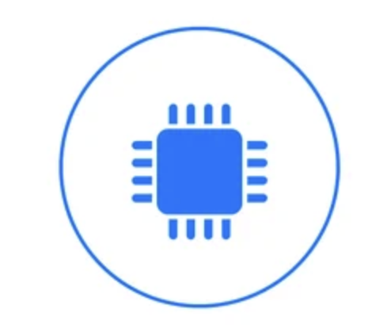

# Computor V2

<!-- <p align="center">
    <a href="" target="_blank">
        
    </a>
</p> -->

<p align="center">
    <a href="" target="_blank">
        
    </a>
</p>


<p align="center">
    <strong>Welcome to Computor V2!</strong>
    <br>
    This repository contains a powerful shell that allows for the assignment of variables, including complex numbers, matrices, polynomials, vectors, and regular numeric values. The shell can perform operations between these types and return the results seamlessly. It supports various mathematical functions, enabling users to assign and manipulate variables for complex calculations.
</p>

<p align="center">
    <a href="https://abdelmathin.github.io/42attachments/subjects/en//42subjects-computorv1.pdf" target="_blank">
        
    </a>
    <a href="#">
        
    </a>
    <a href="https://paypal.me/abdelmathin" target="_blank">
        
    </a>
</p>

# 🌟 Objectives

- **Variable Assignment:** Enable users to assign values to polynomials, functions, matrices, vectors, and complex numbers.
- **Mathematical Operations:** Support basic arithmetic operations and allow calculations between various types of variables.
- **Integrate Mathematical Functions:** Create a tool that integrates mathematical functions and performs operations with different types of variables.
- **Derivative Calculation:** Implement functionality to compute the derivative of functions and analyze rates of change.
- **Matrix Operations:** Facilitate matrix operations such as addition, multiplication, and finding determinants.
- **Complex Number Support:** Allow users to perform arithmetic operations with complex numbers, including real and imaginary components.
- **Higher-Order Derivatives:** Enable the computation of higher-order derivatives for in-depth function analysis.

## Prerequisites

- Ensure you have `make` and a compatible compiler (like `gcc` or `clang`) installed on your system.

# 👨‍💻 Installation

1. **Clone the Repository:**
    ```bash
    git clone git@github.com:Abdelmathin/computorv2.git
    ```

2. **Navigate to the Project Directory:**
    ```bash
    cd computorv2
    ```

3. **Build the Project:**
    ```bash
    make
    ```

# 🚀 Usage

To run the shell, execute the following command:

```bash
./computor
```

### Supported Functions

Computor V2 offers a wide range of mathematical functions for users to leverage in their calculations. Here’s a sample of how to use some of the supported functions within the shell:

```cpp
#include <iostream>
#include "computorv2.hpp"

int main(void)
{
    computorv2::IndependentVariable x("x");

    std::cout << "ln(x)      = " << computorv2::ln(x)      << std::endl;
    std::cout << "exp(x)     = " << computorv2::exp(x)     << std::endl;
    std::cout << "sin(x)     = " << computorv2::sin(x)     << std::endl;
    std::cout << "cos(x)     = " << computorv2::cos(x)     << std::endl;
    std::cout << "tan(x)     = " << computorv2::tan(x)     << std::endl;
    std::cout << "arcsin(x)  = " << computorv2::arcsin(x)  << std::endl;
    std::cout << "arccos(x)  = " << computorv2::arccos(x)  << std::endl;
    std::cout << "arctan(x)  = " << computorv2::arctan(x)  << std::endl;
    std::cout << "sinh(x)    = " << computorv2::sinh(x)    << std::endl;
    std::cout << "cosh(x)    = " << computorv2::cosh(x)    << std::endl;
    std::cout << "tanh(x)    = " << computorv2::tanh(x)    << std::endl;
    std::cout << "arcsinh(x) = " << computorv2::arcsinh(x) << std::endl;
    std::cout << "arccosh(x) = " << computorv2::arccosh(x) << std::endl;
    std::cout << "arctanh(x) = " << computorv2::arctanh(x) << std::endl;

    return (0);
}
```


### Examples

Here’s a simple examples of how to use the shell:

1. **Assign a polynomial:**

	In this example, a polynomial p is assigned, which is a quadratic function. The coefficients 2, 3, and 5 represent the constants for x<sup>2</sup>, x, and the constant term, respectively.

	This polynomial can be used for further calculations, evaluations, and derivative computations.

	```bash
	p = 2*x^2 + 3*x + 5
	```

2. **Assign a function:**

	Here, a function g(x) is defined, which combines a trigonometric function, the sine of x, multiplied by x, and the natural logarithm of x + 2i.

	This showcases the shell's ability to handle both real and complex functions, providing a powerful tool for mathematical analysis.

	```bash
	g(x) = sin(x) * x - ln(x + 2i)
	```

3. **Calculate the derivative:**

	In this step, a new function f(x) is created by adding the sine function to the derivative of g(x).

	This demonstrates the shell's capability to compute derivatives and use them in subsequent functions, allowing for complex mathematical manipulations.

	```bash
	f(x) = sin(x) + g'(x)
	```

4. **Assign a matrix:**

	A matrix M is defined, which is a 2x2 array containing integers.

	This matrix can be used for various operations, such as transformations, multiplications, and more complex linear algebra tasks.

	```bash
	M = [[1, 2], [3, 4]]
	```

5. **Perform a matrix operation:**

	Here, the matrix M is multiplied by itself.

	The shell computes the resulting matrix, demonstrating its ability to handle matrix operations effectively.

	The result will yield a new matrix, which can be used for further calculations or analyses.

	```bash
	result = M * M
	```

6. **Assign a complex number:**

	A complex number c is assigned, which consists of a real part (3) and an imaginary part (4).

	This example showcases the shell's support for complex number calculations, essential for many mathematical applications, particularly in engineering and physics.

	```bash
	c = 3 + 4i
	```

7. **Perform operations with the complex number:**

	In this example, the previously assigned complex number c is added to another complex number 1 + 2i. The shell computes the sum, resulting in a new complex number that combines both real and imaginary parts. This illustrates how users can perform arithmetic operations with complex numbers, enhancing the versatility of the tool.

	```bash
	result = c + (1 + 2i)
	```

8. **Evaluate a polynomial at a specific value:**

	The polynomial p is evaluated at x = 2. The shell computes the result, providing insights into the behavior of the polynomial at that specific point.

	```bash
	value = p(2)
	```

### Example: Working with Complex Numbers:

Computor V2 allows users to easily define and manipulate complex numbers. Here’s an example of how to work with complex numbers within the shell:

```C++
#include <iostream>
#include "computorv2.hpp"

int main(void)
{
    // Assign a complex number
    computorv2::Complex c1(3, 4); // Represents 3 + 4i
    computorv2::Complex c2(1, 2); // Represents 1 + 2i

    // Perform arithmetic operations
    computorv2::Complex sum        = c1 + c2; // Addition
    computorv2::Complex difference = c1 - c2; // Subtraction
    computorv2::Complex product    = c1 * c2; // Multiplication
    computorv2::Complex quotient   = c1 / c2; // Division

    // Display results
    std::cout << "c1         = " << c1         << std::endl;  // Outputs: 3 + 4i
    std::cout << "c2         = " << c2         << std::endl;  // Outputs: 1 + 2i
    std::cout << "Sum        = " << sum        << std::endl;  // Outputs: 4 + 6i
    std::cout << "Difference = " << difference << std::endl;  // Outputs: 2 + 2i
    std::cout << "Product    = " << product    << std::endl;  // Outputs: -5 + 10i
    std::cout << "Quotient   = " << quotient   << std::endl;  // Outputs: 2.2 - 0.4i

    return (0);
}

```

### Example: Working with Matrices

```C++
#include <iostream>
#include "computorv2.hpp"

int main(void)
{
    // Create a 3x2 matrix and set its elements
    computorv2::Matrix m(3, 2);
    m.setElementAt(0, 0, 6.0);
    m.setElementAt(1, 0, 5.0);
    m.setElementAt(2, 0, 0.0);

    m.setElementAt(0, 1, 10.0);
    m.setElementAt(1, 1, 3.0);
    m.setElementAt(2, 1, 2.0);

    // Display the first matrix
    std::cout << "Matrix M (3x2):" << std::endl;
    std::cout << m << std::endl;

    // Create and display a 3x3 matrix
    computorv2::Matrix m3x3(
        1, 2, 3, 
        4, 5, 6, 
        7, 8, 9);
    std::cout << "3x3 Matrix:" << std::endl;
    std::cout << m3x3.toString() << std::endl;

    return (0);
}

```

## ✍️ Contributing

Contributions are welcome! Please feel free to submit a pull request or open an issue to suggest improvements or report bugs.

## License

This project is licensed under the MIT License - see the LICENSE file for details.


<!--

# Derivative:

- To differentiate
$$ P(x) = a . x^n + b $$
where a, x, n, b are all functions of x, we use the product rule, the chain rule, and the general power rule.


$$
\begin{bmatrix}
 0 & 0 & 0 & 0 \\
 0 & 0 & 0 & 0 \\
 0 & 0 & 0 & 0 \\
 0 & 0 & 0 & 0 \\
\end{bmatrix}
$$
--->

<!-- $$  P(x) = a . x^n + b $$

$$  \frac{d P(x)}{d x} = \frac{d a}{d x} . x^n + a . \frac{d x^n}{d x} + \frac{d b}{d x} $$
$$ \frac{d x^n}{d x} = $$ -->


